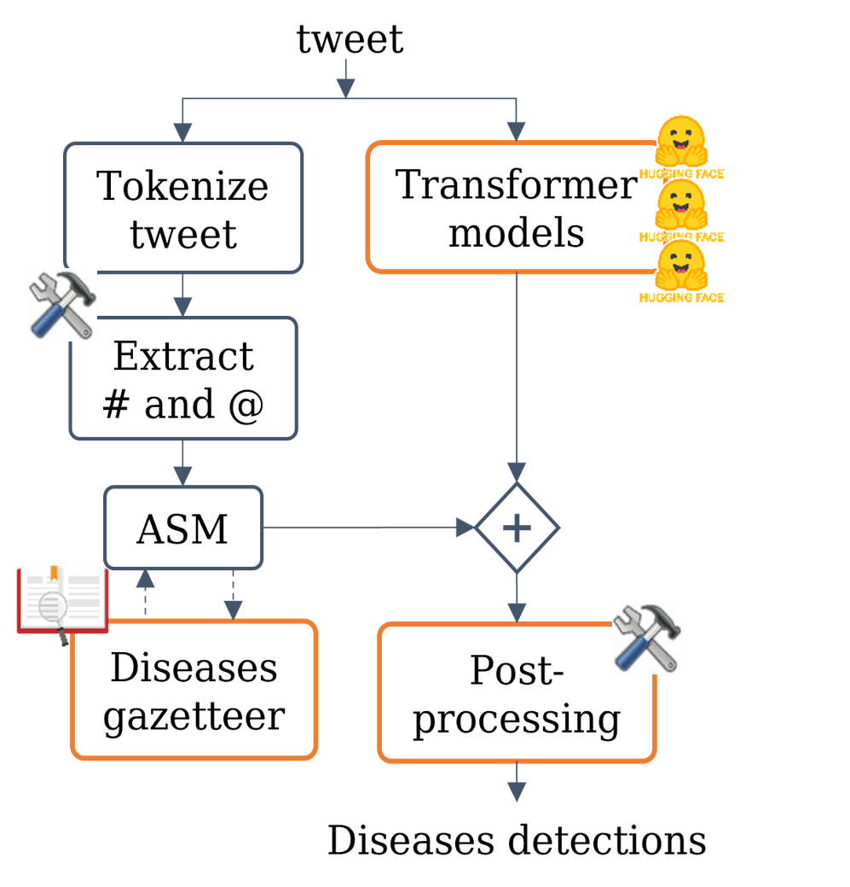

# ITAINNOVA at SocialDisNER
**Detection of disease mentions in tweets  (in Spanish, SMM4H 2022 – Task 10)**

[Task info](https://temu.bsc.es/socialdisner/)

The main source code is organized as follows:

/nb:
Notebooks used for data checking

/python:
Python source code
   - /data:
For corpus transformations needed: offsets to BILOU and BIO tagging scheme

   - /disease_classifier:
Specific funcionality developed for the prediction task: transformers-based model and predictor, gazetters,  filters and normalization

   - /token_classifier:
General Token Classifier implemented over Transformers. It also implements and optimized hyperparameter finetuning connected to Wandb

/script:
Command line scripts to launch training and predictions

/test:
Unitary tests

Models and files paths have to be set up in the python/config.py script (full paths recommended).
Wandb functionality has been deactivated.

----------
# Paper
[ITAINNOVA at SocialDisNER: A Transformers cocktail for disease identification in social media in Spanish](https://aclanthology.org/2022.smm4h-1.21/)

 

# More info at: 
[Biomedical Text Mining YOUTUBE channel](https://youtu.be/Z1BJCHkhSBo)

----------
# Contributors
Rosa Montañés - [@erremesse](https://github.com/erremesse)

Luis García Garcés - [@luisgg98](https://github.com/luisgg98)

Irene López Bosque - [@irenebosque](https://github.com/irenebosque)

Rafael del Hoyo Alonso - [@neuralconcept](https://github.com/neuralconcept) 